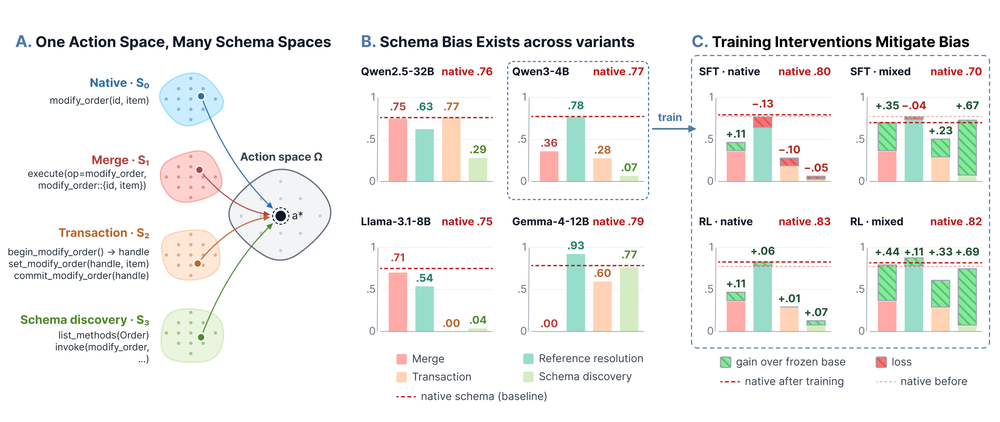

<div align="center">

# ToolSchemaSpace

**[Action-Space Shaping for LLM Agents: Measuring and Mitigating Tool-Schema Bias](https://arxiv.org/abs/2609.34971)**

Yinhong Liu, Zhili Tan, Zilin Wang, Zhijiang Guo

University of Cambridge · Yinwang · Huawei · LARK, HKUST (GZ) · HKUST

[](https://arxiv.org/abs/2609.34971)
[](LICENSE)
[](pyproject.toml)
[](#tests)

[Paper](https://arxiv.org/abs/2609.34971) · [Overview](#overview) · [Installation](#installation) · [Quick start](#quick-start) · [Operators](#schema-operators) ·
[Synthetic benchmark](#synthetic-benchmark) · [Real benchmarks](#real-benchmarks) ·
[Reproduction](#reproducing-the-paper) · [Citation](#citation)

</div>

<p align="center">
  
</p>

<p align="center"><sub><b>Figure 1.</b>
<b>(A)</b> Every schema variant S<sub>i</sub> is a different representation of the same action space Ω: a call in any of
them decodes to the same native action a* and reaches the same final state.
<b>(B)</b> Schema bias is large and model-specific: the same variant can match the native schema for one model and collapse to
zero for another.
<b>(C)</b> After SFT or RL of Qwen3-4B, native-only data leaves most of the bias in place, while RL on variant-mixture data
mitigates it and keeps the native score.</sub></p>

## Overview

LLM agents are usually evaluated with one fixed tool schema. A tool schema is not the agent's action space, though; it is
one interface to it. The same executable action can be exposed through many functionally equivalent tool definitions:
one dispatcher or many small tools, flat or nested arguments, a single call or a begin/set/commit transaction. An agent
that has learned the task should behave consistently across them. Current agents often do not, which we call
**schema bias**.

This repository provides:

- **An executable transformation framework** (`toolschema/`). Nine operators rewrite a native tool schema into variants,
  and every call made in a variant is decoded back into native actions. Tasks, executable actions and reachable states
  stay fixed, so a change in success is attributable to the interface alone.
- **A synthetic benchmark** (`benchmarks/synthetic/`): 12 domains, 168 tools and 2,748 tasks with programmatic gold calls,
  plus the spec file of every variant in the paper.
- **Adapters for four existing benchmarks** (`adapters/`): τ²-bench, BFCL v3 multi-turn, AutomationBench and MCP-Atlas.
  All four run through an OpenAI-compatible **schema proxy** that works with any agent harness, unchanged.
- **Equivalence tests** (`tests/`). Every variant is proven lossless before use: a perfect model scores 1.0 on all of them.

### Findings

- **Schema bias is large and structured.** Across eleven LLMs, including two closed models, and up to 32 variants,
  success ranges from complete failure to 97% depending only on the schema. The hardest representation differs across
  model families, and neither the newest open models nor the closed models are immune.
- **Failures follow the variant.** A given schema tends to break different models in the same way, while how much it
  costs depends on the model.
- **Predicting difficulty needs the target queries.** Reliably ranking variants by difficulty requires running a small
  sample of the target queries; probes that use no task queries are not enough.
- **Training repairs what it sees.** A variant is repaired only when it appears in the training data. On-policy RL does
  so without the tax that SFT imposes on other variants, and the gains extend to new combinations of trained schema
  changes but not to new kinds of change.

## Installation

```bash
git clone https://github.com/williamLyh/ToolSchemaSpace.git
cd ToolSchemaSpace
pip install -e .            # installs the `toolschema` package (depends on openai, aiohttp)
```

Python 3.10 or newer is required. Run the benchmark, evaluation and test modules from the repository root
(`python -m ...`). The transformation framework itself needs no model. Evaluation needs an inference server;
see [Reproducing the paper](#reproducing-the-paper).

## Quick start

The Quick start shows the core use of the framework: **transforming a tool schema**. You give it your native tools
and an operator spec. It returns

1. the **variant schema** to show the model,
2. a **decoder** that turns the model's calls in that variant back into native calls, which your environment
   executes unchanged,
3. an **oracle encoder** that writes any native call in the variant's vocabulary, i.e. how a perfect model would
   act. The equivalence tests use it.

### Example: merge two tools into one dispatcher

**Native schema.** Two tools, in the canonical `{name, description, parameters}` form. OpenAI-format
`{"type": "function", "function": {...}}` tools work too.

```python
from toolschema.operators import compile_spec

native_tools = [
    {"name": "set_window", "description": "Open, close, or vent a car window.",
     "parameters": {"type": "object",
                    "properties": {"position": {"type": "string", "enum": ["front_left", "front_right"]},
                                   "state": {"type": "string", "enum": ["open", "closed", "vent"]}},
                    "required": ["position", "state"]}},
    {"name": "set_seat_heat", "description": "Set the heating level of a seat.",
     "parameters": {"type": "object",
                    "properties": {"seat": {"type": "string"}, "level": {"type": "integer"}},
                    "required": ["seat", "level"]}},
]
```

**1. Transform.** The operator spec merges both tools into one `execute` dispatcher with nested arguments:

```python
spec = {"ops": [{"op": "merge", "tools": ["set_window", "set_seat_heat"],
                 "into": "execute", "encoding": "nested"}]}
variant = compile_spec(native_tools, spec)
variant.tools          # the schema to give the model
```

```json
[{"name": "execute",
  "description": "Dispatch entry point handling ONLY these 2 operations: set_window, set_seat_heat. Set `operation`, then put that operation's own arguments inside `arguments`. ...",
  "parameters": {"type": "object",
                 "properties": {"operation": {"type": "string", "enum": ["set_window", "set_seat_heat"]},
                                "arguments": {"type": "object",
                                              "properties": {"position": {...}, "state": {...},
                                                             "seat": {...}, "level": {...}}}},
                 "required": ["operation", "arguments"]}}]
```

**2. Decode what the model does.** The model answers in the variant's vocabulary, and the decoder gives back the
native call to execute:

```python
model_calls = [("execute", {"operation": "set_window",
                            "arguments": {"position": "front_left", "state": "vent"}})]
native_calls, flags = variant.decode_seq(model_calls)
# native_calls == [("set_window", {"position": "front_left", "state": "vent"})],  flags == []
```

A call that is invalid in the variant is flagged, not silently executed:

```python
variant.decode_seq([("execute", {"operation": "open_trunk", "arguments": {}})])
# flags == [("bad_execute", "operation must be one of ['set_window', 'set_seat_heat']"), ...]
```

**3. Oracle.** This expresses a native call in the variant, which is what the equivalence tests use:

```python
variant.encode_episode([{"name": "set_seat_heat", "arguments": {"seat": "driver", "level": 2}}])
# [("execute", {"operation": "set_seat_heat", "arguments": {"seat": "driver", "level": 2}})]
```

### The same native call under other operators

Changing only the spec gives a different variant of the same action space. Here is how
`set_window(position="front_left", state="vent")` looks in each; the interval-split row uses
`set_seat_heat(seat="driver", level=3)`.

| spec | tools the model sees | the model's call(s) |
|---|---|---|
| `{"op":"merge","tools":[…],"into":"execute"}` | `execute` | `execute(operation="set_window", set_window::position="front_left", set_window::state="vent")` |
| `{"op":"split_enum","tool":"set_window","params":["state"]}` | `set_window__state_open`, `…_closed`, `…_vent`, `set_seat_heat` | `set_window__state_vent(position="front_left")` |
| `{"op":"split_predicate","tool":"set_seat_heat","param":"level","cuts":[2]}` | `set_window`, `set_seat_heat__level_lt_2`, `set_seat_heat__level_ge_2` | `set_seat_heat__level_ge_2(seat="driver", level=3)` |
| `{"op":"arg_lower","tool":"set_window","into":"options","params":[…]}` | `set_window`, `set_seat_heat` | `set_window(options={"position": "front_left", "state": "vent"})` |
| `{"op":"rename","tool":"set_window","to":"fn_d8abb4"}` | `fn_d8abb4`, `set_seat_heat` | `fn_d8abb4(position="front_left", state="vent")` |
| `{"op":"curry","tool":"set_window"}` | `begin_set_window`, `set_set_window__position`, `set_set_window__state`, `commit_set_window`, … | `begin_set_window()` → `set_set_window__position(txn_id, …)` → `set_set_window__state(txn_id, …)` → `commit_set_window(txn_id)` |

Every row decodes back to the same native call.

### Further examples

- [`examples/quickstart.py`](examples/quickstart.py) runs everything above offline, with no model.
- [`examples/agent_loop.py`](examples/agent_loop.py) puts a variant in front of a live model.
  `toolschema.simenv.SimEnv` decodes each call, answers protocol calls itself (such as transaction begin and set),
  and rejects off-schema calls, so your environment only ever executes native actions.

## Schema operators

A schema variant is `S_i = O(m, S_0)`: operator `O`, applied with method `m`, to the native schema `S_0`. A variant is
written as a JSON spec, a list of operator applications. One spec file can cover a whole multi-domain catalog:

- An operator that names a tool absent from a catalog is ignored.
- When tool names repeat across domains, entries carry a `group`.

| operator | spec entry | what the model sees instead of `set_window(position, state)` |
|---|---|---|
| **merge** | `{"op":"merge","tools":[…],"into":"execute","encoding":"flat\|nested\|union"}` | `execute(operation="set_window", …)` |
| **split** | `{"op":"split_enum","tool":t,"params":["state"]}` · `{"op":"split_predicate",…,"cuts":[…]}` | `set_window__state_vent(position)` |
| **nest / flatten** | `{"op":"arg_lower","tool":t,"into":"options","params":[…]}` · `{"op":"arg_lift",…}` | `set_window(options={position, state})` |
| **rename** | `{"op":"rename","tool":t,"to":"fn_d8abb4"}` | `fn_d8abb4(position, state)` |
| **strip descriptions** | `{"op":"strip_desc","tool":t}` | the same tool, without descriptions |
| **reorder arguments** | `{"op":"shuffle_params","tool":t,"seed":13}` | `set_window(state, position)` |
| **transaction** | `{"op":"curry","tool":t}` | `begin_set_window()` → `set_set_window__…(txn_id, …)` → `commit_set_window(txn_id)` |
| **reference resolution** | `{"op":"indirect","tool":t,"param":p,"values":[…]}` | a resolver returns a handle, which is passed instead of the value |
| **schema discovery** | hierarchy arm `disclose` | `list_methods(class)` → `invoke(class, method, arguments)` |

Operators compose within one spec. The **merge/split ladder** (`SCHEMA_VARIANT=0…9`) is a one-dimensional sweep:

- step 0: one dispatcher per domain;
- step 5: the native schema;
- step 9: every enumerable argument split into tool names.

**Class-level arms** operate on a whole catalog: `toolschema/hierarchy.py` (flat, namespaced, class dispatch, schema
discovery) and `toolschema/class_grouping.py` (class, random and anti-class groupings).

## Synthetic benchmark

The benchmark was built to span the variant space. It has many enumerable arguments (so the split operators have room
to act), tool names that repeat across domains (so class information matters), and programmatic gold calls (so every
task is exactly gradable under every variant).

| domains | native tools | tasks | task types | gold calls per task |
|:---:|:---:|:---:|:---:|:---:|
| 12 | 168 (261 enum arguments) | 2,748 | 585 single · 1,747 compound · 416 compositional | 1–6 |

The data card, file formats and construction pipeline are in [`benchmarks/synthetic/README.md`](benchmarks/synthetic/README.md).
[`registry.json`](benchmarks/synthetic/data/registry.json) maps every variant reported in the paper to its construction.
The full tool schema of native and of every representative variant is stored in
[`benchmarks/synthetic/data/schemas/`](benchmarks/synthetic/data/schemas), one file per variant.

## Real benchmarks

All four real benchmarks run through the **schema proxy** (`toolschema/proxy.py`), with no change to their
environments or scorers. The proxy is an OpenAI-compatible server between each harness and the model, and it:

- rewrites each request's native `tools` into the variant;
- decodes every call the model makes back into native calls;
- answers protocol-internal calls itself (transaction begin and set, `list_methods`);
- rejects off-schema calls with a recoverable error;
- keeps the model's conversation history in the variant vocabulary.

| benchmark | tasks used | upstream | adapter |
|---|---|---|---|
| τ²-bench | airline (50), retail (114) | [sierra-research/tau2-bench](https://github.com/sierra-research/tau2-bench) | [`adapters/tau2`](adapters/tau2) |
| BFCL v3 | `multi_turn_base` (200) | [ShishirPatil/gorilla](https://github.com/ShishirPatil/gorilla) | [`adapters/bfcl`](adapters/bfcl) (small client patch) |
| AutomationBench | `limited_zapier`, 599 of 600 tasks | [zapier/AutomationBench](https://github.com/zapier/AutomationBench) | [`adapters/automationbench`](adapters/automationbench) |
| MCP-Atlas | 89 tasks runnable in the key-free sandbox | [scaleapi/mcp-atlas](https://github.com/scaleapi/mcp-atlas) | [`adapters/mcp_atlas`](adapters/mcp_atlas) |

```bash
python -m toolschema.proxy --op merge --upstream http://127.0.0.1:8000/v1 --port 8100 \
    [--classes adapters/<benchmark>/classes.json] [--cuts adapters/<benchmark>/cuts.json]
# then point the harness's OpenAI base URL at http://127.0.0.1:8100/v1
```

**Operators.** `--op` selects the variant:

| `--op` | variant |
|---|---|
| `native` | native schema |
| `merge` | fully merged |
| `merge_app` | class dispatch |
| `split` | fully split (required enum arguments) |
| `pred` | interval split |
| `nest` | nested args |
| `rename_ns` | namespaced names |
| `strip` | strip descriptions |
| `reorder` | reorder arguments |
| `transaction` | transaction |
| `disclose` | schema discovery |
| `composed` | composed |
| `rename_opaque` | opaque names (appendix variant) |

Reference resolution needs a value table drawn from the task data, so it is available through the synthetic
benchmark and the τ² patch, not the proxy.

**Classes and cuts.** For each benchmark, `--classes` gives the class of every tool (the app, API or entity) and
`--cuts` the interval-split cut of every required numeric argument. `python -m tests.test_proxy <catalog>
<task_tools> --classes … --cuts …` checks that every operator is lossless on a catalog.

**Protocol.** `--protocol` sets what happens to a call the variant schema rejects:

- `nofeedback` (the setting of the paper's real-benchmark results): the call is dropped, with no error and no retry,
  and a turn left with no valid call ends as text. The multi-step protocols (transaction, schema discovery) still
  answer their own steps, for at most eight model calls per turn.
- `feedback` (default): the call is answered with an error and the model is re-queried in the same turn.

**Budgets.** Under `feedback`, the re-query loop ends after `--max-inner` model calls (16), or after `--turn-budget`
seconds (3600), whichever comes first, and the turn then ends as text. `--call-timeout` (1800 s) caps one upstream model call. A
timed-out or repeatedly failing upstream call is answered with a non-retryable 422, so harnesses that retry 5xx
responses do not loop on a degenerate generation.

Each adapter directory has setup notes, a run script, and the benchmark-specific pitfalls we hit.

## Reproducing the paper

Reproducing the paper takes three steps:
1. start an inference server for the model under test;
2. run the evaluation against it;
3. summarise the per-episode records.

### 1. Start an inference server

The evaluation talks to any **OpenAI-compatible Chat Completions endpoint with tool calling**. We served every open
model with [vLLM](https://github.com/vllm-project/vllm):

```bash
pip install vllm
vllm serve Qwen/Qwen3-4B-Instruct-2507 --port 8000 \
    --enable-auto-tool-choice --tool-call-parser hermes \
    --max-model-len 32768 --enable-prefix-caching
```

For larger models, spread them over GPUs with `--tensor-parallel-size` and `--data-parallel-size`. For example,
Qwen3.5-27B on 8 × 32 GB GPUs: `--tensor-parallel-size 4 --data-parallel-size 2`, or two such servers behind a
load balancer.

The tool-call parser (and, for thinking models, the reasoning parser) must match the model family:

| model family | vLLM flags |
|---|---|
| Qwen2.5, Qwen3 (instruct) | `--tool-call-parser hermes` |
| Qwen3.5 (thinking) | `--tool-call-parser qwen3_xml --reasoning-parser qwen3` |
| Llama-3.1 | `--tool-call-parser llama3_json --chat-template examples/tool_chat_template_llama3.1_json.jinja` (the template ships with vLLM) |
| Gemma-4 | `--tool-call-parser gemma4` |

Check the server before running anything:

```bash
curl http://localhost:8000/v1/models
```

- **Prefix caching:** agent episodes resend the whole conversation every turn, so `--enable-prefix-caching` speeds
  them up a lot. Hybrid-attention models such as Qwen3.5 do not enable it by default.
- **Concurrency:** keep the total concurrency across your evaluation jobs at or below what the server runs at once
  (`vllm:num_requests_running` in `/metrics`, with `vllm:num_requests_waiting` near 0). Requests that wait in the
  server's queue count against the harness timeouts.
- **Closed models:** the same runners work against an API endpoint. Set `REMOTE_OPENAI_BASE_URL` and
  `REMOTE_OPENAI_API_KEY`, and `SYN_API=responses` for the OpenAI Responses API.

### 2. Run the evaluation

Point the runners at the server:

```bash
export REMOTE_OPENAI_BASE_URL=http://localhost:8000/v1
export SYN_MODEL=Qwen/Qwen3-4B-Instruct-2507      # the served model name
```

**All variants of a paper figure or table.** `eval/run_registry.py` looks each variant up in
[`registry.json`](benchmarks/synthetic/data/registry.json) and runs it with the right runner and settings:

```bash
python -m eval.run_registry --list                                     # every variant and how it is built
python -m eval.run_registry --figure "Figure 2" --out results/qwen3-4b # the representative variants
python -m eval.run_registry --figure "Appendix" --out results/qwen3-4b # every appendix figure and table
```

| paper artefact | variants | command |
|---|---|---|
| Figure 1 (B), Figure 2: representative variants | 13 | `run_registry --figure "Figure 2"` |
| Appendix figure: remaining methods of each operator (`operator · method`) | 19 | `run_registry --figure "remaining methods"` |
| Appendix: argument structure of a merged tool | 6 | `run_registry --figure "argument structure"` |
| Appendix: convention-mixture test | 12 | `run_registry --figure "convention mixture"` |
| Real-benchmark results | 12 variants × 4 benchmarks | see [Real benchmarks](#real-benchmarks) and [`adapters/`](adapters) |

**A single variant.** Each variant type has its own runner:

```bash
SCHEMA_VARIANT=0 SCHEMA_DATASET=synthetic SCHEMA_CONTROL=hard OUT_JSONL=v0.jsonl \
    python -m eval.run_agentic                                            # a merge/split ladder step
SCHEMA_SPEC=benchmarks/synthetic/data/specs/curry.json SCHEMA_DATASET=synthetic \
    python -m eval.run_agentic                                            # an operator spec (transaction)
HIER_ARM=dispatch python -m eval.run_hierarchy                            # a class-level arm
SCHEMA_SPEC=benchmarks/synthetic/data/specs/class_neutral.json \
    python -m eval.run_class_grouping                                     # a class-grouping arm
```

- **Episodes.** An episode runs up to 16 turns. The simulated environment executes the model's decoded calls.
- **Scoring.** An episode succeeds when the multiset of executed native actions equals the gold calls.
- **Control modes.** `SCHEMA_CONTROL=hard` (the paper's setting) rejects off-schema calls with a recoverable error;
  `loose` executes them anyway.
- **Outputs.** `OUT_CSV` receives per-domain aggregates; `OUT_JSONL` receives one record per episode.
- **Other settings.** `SYN_WORKERS` (concurrency), `SYN_TEMP` (0 in the paper), `SYN_SEED`, `SYN_TOOLCHOICE`,
  `SYN_EXTRA_BODY` (e.g. `{"chat_template_kwargs":{"enable_thinking":false}}`) and `MAX_TURNS`.

### 3. Summarise

`eval/taxonomy.py` assigns every failed episode one of seven failure modes: livelock, transaction handle,
rejected-and-stuck, wrong class, under-execution, over-execution or wrong arguments.

```python
import json
from eval.taxonomy import profile
rows = [json.loads(line) for line in open("v0.jsonl")]
profile(rows)   # {'n': .., 'success': .., 'livelock': .., 'txn_handle': .., ...}
```

Model outputs and figure data will be released under [`results/`](results).

## Tests

A variant is admitted only if it is **lossless**. The gold calls of every task are encoded with the variant's oracle
and decoded back under hard control; the result must be exactly the gold, with no rejections. The suites below check
this for every construction the paper uses.

```bash
python -m tests.test_ladder            # merge/split ladder, 10 steps          (78,180 decodes)
python -m tests.test_ops               # operator specs incl. call sequences
python -m tests.test_ops2              # enum splits, grouped merges, surface operators
python -m tests.test_spec_files        # every shipped spec file              (137,400 episodes)
python -m tests.test_merge_encodings   # flat / nested / union structures and mixtures
python -m tests.test_hierarchy         # class-level arms
python -m tests.test_simenv            # the same, through the simulated environment
python -m tests.test_proxy             # the schema proxy, all 13 operators
```

`tests.test_proxy catalog.json task_tools.json [--classes …] [--cuts …]` runs the same check on any real tool
catalog. Each tool is checked with only its required arguments and with optional ones, and numeric values are sampled
on both sides of every cut. All 13 operators pass on the AutomationBench, τ²-bench, BFCL and MCP-Atlas catalogs.

## Repository structure

```
toolschema/                transformation framework (pip package)
├── operators.py             spec compiler: compile_spec → variant catalog, oracle encoder, sequence decoder
├── schema_adapter.py        merge/split ladder; SCHEMA_VARIANT / SCHEMA_SPEC entry point for benchmark hooks
├── merge_encodings.py       flat / nested / union argument structures
├── hierarchy.py             class-level arms over a whole catalog
├── class_grouping.py        class / random / anti-class groupings
├── simenv.py                simulated environment (decode, protocol calls, hard control)
├── curry_seam.py · indirect_seam.py · disclose_seam.py   multi-call protocols for real environments
└── proxy.py                 OpenAI-compatible schema proxy
benchmarks/synthetic/      the synthetic benchmark
├── data/                    tools.json · queries.jsonl · specs/ · registry.json · schemas/
├── domains.py · build.py    catalog and task construction
├── generation/              LLM rewriting of task queries
└── write_specs.py           regenerates data/specs
eval/                      runners, registry runner, failure taxonomy
adapters/                  tau2 · bfcl · automationbench · mcp_atlas
examples/                  quickstart.py · agent_loop.py
tests/                     equivalence suites
results/                   released outputs (reserved)
```

## Citation

If you use the framework or the benchmark, please cite:

```bibtex
@article{liu2026actionspace,
  title   = {Action-Space Shaping for {LLM} Agents: Measuring and Mitigating Tool-Schema Bias},
  author  = {Liu, Yinhong and Tan, Zhili and Wang, Zilin and Guo, Zhijiang},
  journal = {arXiv preprint arXiv:2609.34971},
  year    = {2026},
  url     = {https://arxiv.org/abs/2609.34971}
}
```

## License

This repository is released under [CC BY 4.0](LICENSE). Third-party material keeps its own license:

- the adapter patches modify τ²-bench (MIT) and BFCL (Apache-2.0);
- `adapters/mcp_atlas/sandbox/` is a small launcher override for the MCP-Atlas sandbox (MIT);
- `adapters/tau2/data/tasks.json` is derived from τ²-bench (MIT);
- AutomationBench and MCP-Atlas (both MIT) are not redistributed and are fetched from their upstream repositories.

## Acknowledgements

We thank the authors of τ²-bench, BFCL, AutomationBench and MCP-Atlas for releasing their benchmarks, and the vLLM
team for the inference engine used throughout.
