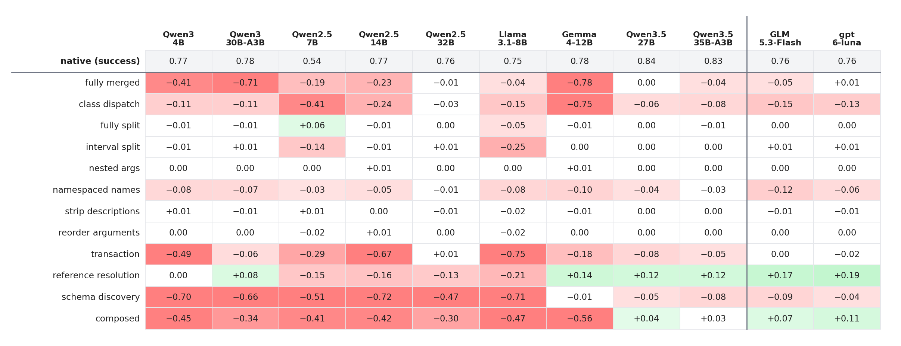
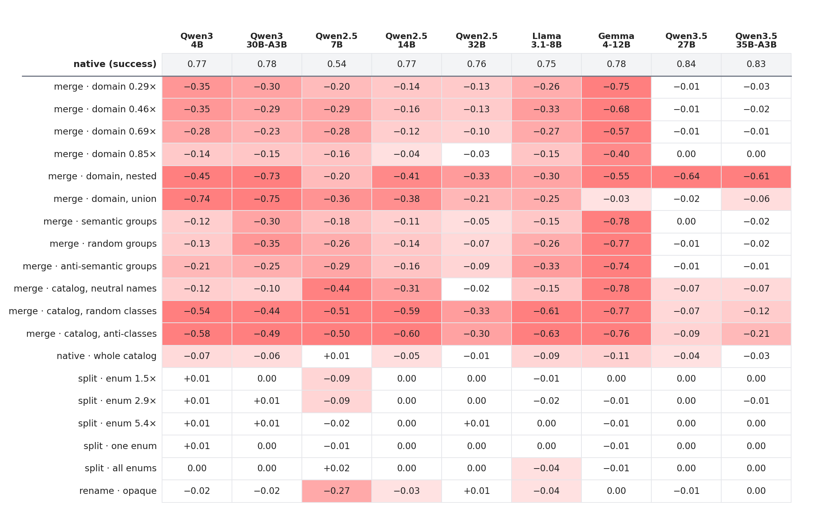
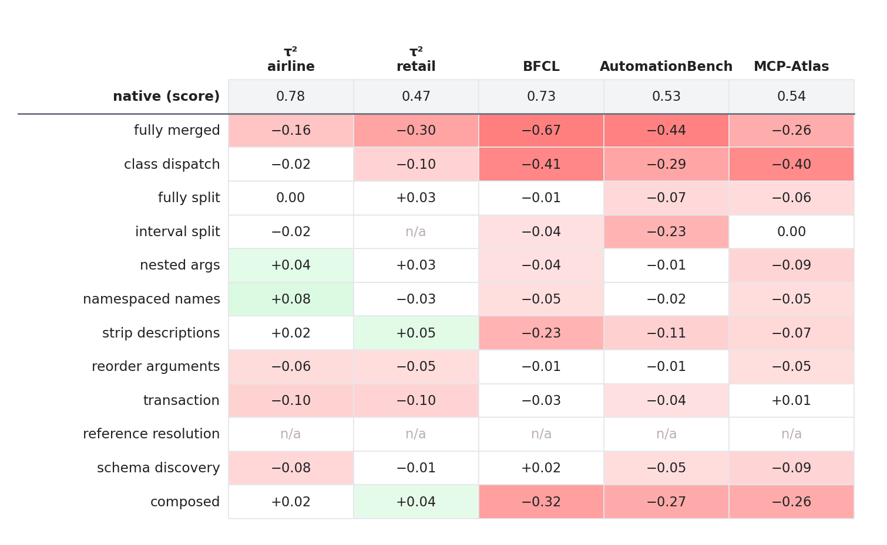
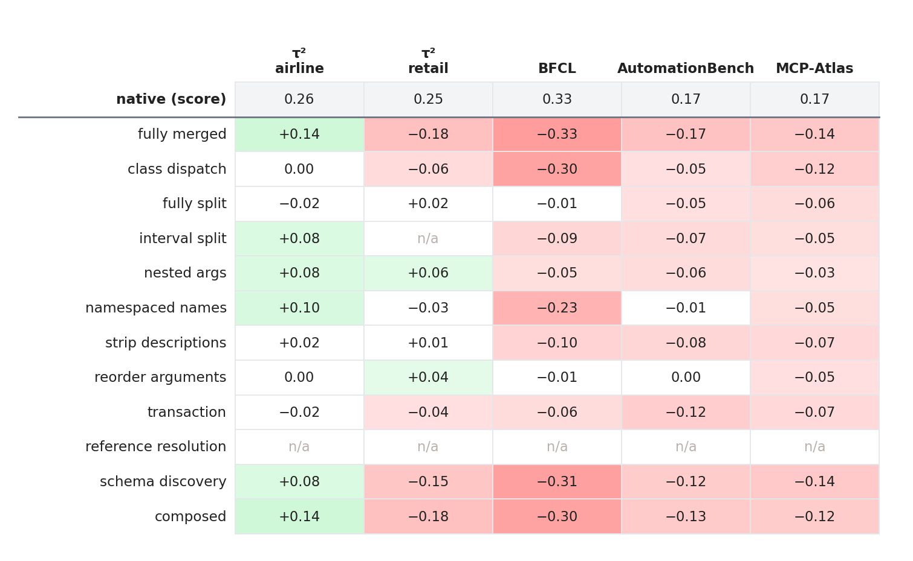
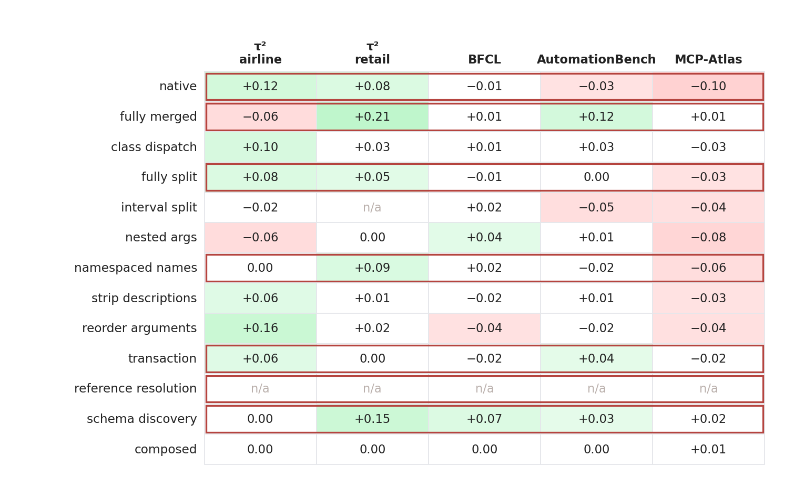
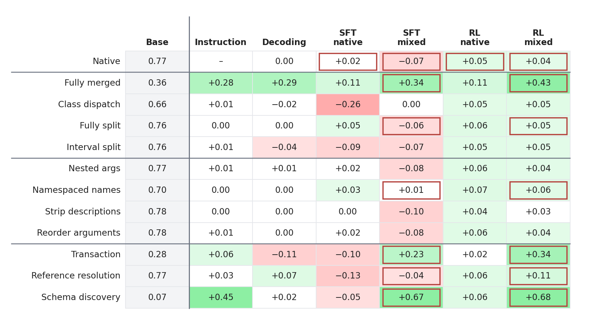

# Results

Evaluation outputs behind the paper. The numbers for every figure are in [raw_tables.md](raw_tables.md), and the
CSVs sit next to each figure.

**How to read the figures.** The first row (**native**) is the baseline score. Every other cell is the change from
native for the same model and benchmark. Shading follows Table 3 of the paper:

- **green** is a gain and **red** a loss;
- a change smaller than 0.03 is not shaded;
- the shade deepens linearly up to a change of 0.45.

## Synthetic benchmark: all models × representative variants

2,748 tasks per cell, hard control, with the same queries and scorer as the paper. The rows are the variants of
Figure 2. The columns are 9 open-weight models and, behind the vertical rule, 2 closed models.

## Synthetic benchmark: remaining methods of each operator

The variants of the paper's appendix operator figure, for the 9 open-weight models.

## Real benchmarks: Qwen3.5-27B × representative variants

Every benchmark runs through the schema proxy under hard control, with Qwen3.5-27B served by vLLM, and with no
self-correction (`--protocol nofeedback`). A call that the variant schema rejects is dropped, with no error and no
retry; a turn left with no valid call ends as text. The multi-step protocols (transaction, schema discovery) answer
their own steps, for at most eight model calls per turn. On τ², the model under test is also the user simulator and
the natural-language judge. Each column uses the benchmark's own score:

| column | tasks | score |
|---|---|---|
| τ² airline | 50 | mean reward |
| τ² retail | 114 | mean reward |
| BFCL | 200 (v3 `multi_turn_base`) | accuracy |
| AutomationBench | 599 (`limited_zapier`) | mean partial credit |
| MCP-Atlas | 89 (key-free sandbox) | mean claim coverage, judged by Qwen3.8-27B |

- **n/a:** reference resolution is not run on real benchmarks, because it needs value tables drawn from the task
  data. Interval split does not apply to τ² retail, which has no numeric arguments.
- All cells are final.

## Real benchmarks: Qwen3-4B × representative variants

The same runs with Qwen3-4B-Instruct-2507 as the agent, with no training (zero-shot). Everything else is
unchanged; on τ², Qwen3-4B is its own user simulator and NL judge. The small model is far more sensitive to the
schema. Fully merged, class dispatch, schema discovery and composed cost it most of its score on every benchmark
except τ² airline.

## Mitigation on real benchmarks: RL on mixed-variant data

This is the RL mixed column of Table 3 (seed 42), evaluated on the real benchmarks. Each cell is the trained model's
score minus the untrained model's score, on the same variant and benchmark. A **red frame** marks a variant that is
in the training data. The gains are confined to trained variants (fully merged, schema discovery): their mean change
is +0.03, against +0.003 for the variants outside the training data. Native rises on τ², where the trained model is
also the user simulator, and drops on BFCL, AutomationBench and MCP-Atlas. The trained model's own table, with changes from its native score, is in
`real/qwen3-4b-rl/`.

## Estimating variant difficulty on real benchmarks

How well each estimator of the paper's RQ3 ranks one model's variants on one benchmark. Each cell is the Spearman ρ
between the estimate and the model's full score over the variants (`real/rq3_estimators.csv`). The estimators:

- **compliance:** share of 36 schema-derived single-operation instructions whose first native call arrives
  with no rejection.
- **exact call:** the same, and the call equals the instructed one.
- **likelihood:** log-probability of the correct variant calls.
- **36-task sample:** 36 random tasks, scored against the tasks not drawn.

**Split-half** is the rank agreement between two random halves of the tasks. It bounds what any estimator can
reach. The table keeps the cells where it is at least 0.65; in the others, mostly on τ², the variants differ by less
than the task noise.

| model | benchmark | split-half | compliance | exact call | likelihood | 36-task sample |
|---|---|---:|---:|---:|---:|---:|
| Qwen3.5-27B | BFCL | 0.82 | 0.50 | 0.67 | 0.25 | 0.80 |
| Qwen3.5-27B | AutomationBench | 0.98 | 0.36 | 0.71 | 0.66 | 0.92 |
| Qwen3.5-27B | MCP-Atlas | 0.75 | 0.51 | 0.87 | 0.50 | 0.76 |
| Qwen3-4B | τ² retail | 0.75 | 0.67 | 0.68 | 0.67 | 0.73 |
| Qwen3-4B | BFCL | 0.92 | 0.34 | 0.67 | 0.56 | 0.88 |
| Qwen3-4B | AutomationBench | 0.94 | 0.80 | 0.84 | 0.52 | 0.91 |
| Qwen3-4B | MCP-Atlas | 0.75 | 0.85 | 0.64 | 0.67 | 0.73 |
| Qwen3-4B RL | BFCL | 0.94 | 0.53 | 0.40 | −0.54 | 0.90 |
| Qwen3-4B RL | AutomationBench | 0.92 | 0.61 | 0.56 | −0.15 | 0.78 |

The 36-task sample comes close to the split-half bound throughout. Of the query-free probes, the exact-call check
is the most useful for untrained models. After RL the probes no longer track task difficulty. The trained model
passes nearly every isolated probe (compliance 0.97 to 0.99), and its call likelihood is anti-correlated with task
success on BFCL (−0.54).

## Mitigation: can training remove schema bias?

This is Table 3 of the paper. Qwen3-4B on the synthetic benchmark, 2,748 tasks per cell, over the 12
representative variants. **Base** is the untrained model's success. Every other column is the change from Base on
the same variant:

| column | method |
|---|---|
| Instruction | a one-sentence description of the variant's calling convention, added to the prompt |
| Decoding | the first call is forced to be schema-valid by constrained decoding |
| SFT native | supervised fine-tuning on native-schema traces |
| SFT mixed | supervised fine-tuning on traces rotating over seven variants |
| RL native | on-policy RL (GRPO) on native-schema tasks |
| RL mixed | on-policy RL (GRPO) on tasks rotating over seven variants |

The SFT columns average several seeds, as do the RL mixed columns; RL native is a single run.

Shading is as above. A **red frame** marks a variant that is in that method's training data. The seven variants in
the mixed data are native, fully merged, fully split, namespaced names, transaction, reference resolution and
schema discovery.

## Files

| file | contents |
|---|---|
| `raw_tables.md` | all tables above as numbers |
| `synthetic/representative_long.csv` | one row per model × variant: task count, success, change from native, and the rate of each failure mode (livelock, transaction handle, rejected-and-stuck, wrong class, under-execution, over-execution, wrong arguments, other) |
| `synthetic/representative_{success,delta}.csv` | success, and change from native, as variant × model matrices |
| `synthetic/appendix_*` | the same for the appendix variants (open models) |
| `real/real_long.csv` | one row per variant × benchmark: metric, number of tasks, score, change from native, pass rate (AutomationBench) |
| `real/real_{score,delta}.csv` | scores, and change from native, as variant × benchmark matrices |
| `real/qwen3-4b/`, `real/qwen3-4b-rl/` | the same files for Qwen3-4B zero-shot and after RL mixed7 |
| `real/rq4_rl_vs_zeroshot.csv` | zero-shot score, RL score and the change, per variant × benchmark, with the training-data flag |
| `real/rq3_estimators.csv` | Spearman ρ of every estimator per model × benchmark, with the split-half bound and the score range |
| `mitigation/mitigation_{score,delta}.csv` | Table 3: absolute success per method, and change from Base, with the methods whose training data contain each variant |
| `*/..._delta.{png,svg}` | the figures |

The failure-mode rates are shares of all tasks; with the success rate they sum to 1, and they are the segments of
Figure 2. All files are regenerated from the raw per-episode records by `analysis/export_open_results.py` and
`analysis/export_real_results.py`, `analysis/export_real_rq4.py`, `analysis/rq3_real_estimators.py` and
`analysis/export_mitigation_results.py` in the research code base.
